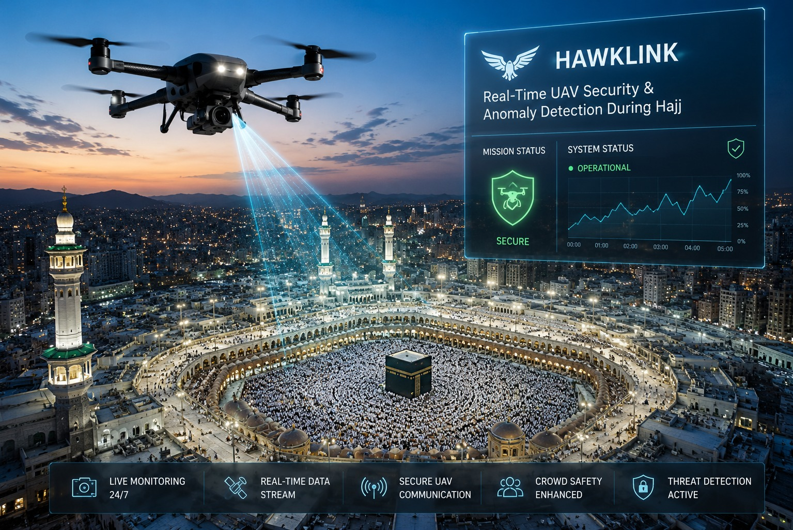

# HawkLink – AI-Based UAV Cybersecurity Framework
🏆 **1st Place Winner – Health & Security in Hajj Hackathon 2026**

AI-based cybersecurity framework for detecting GPS spoofing and command hijacking attacks targeting UAV communications during Hajj through real-time monitoring and machine learning.

  

---

## 📖 Overview

HawkLink is an AI-based cybersecurity framework developed as a graduation project at the University of Jeddah. The framework enhances UAV communication security by detecting cyber threats in real time and providing timely alerts for potential attacks.

---

## ✨ Project Highlights

- 🥇 1st Place – Health & Security in Hajj Hackathon (2026)
- 🎓 Graduation Project – University of Jeddah
- 🤖 AI-based anomaly detection
- 📊 Achieved **96.45%** detection accuracy
- 🚁 Designed for secure UAV communications during Hajj

---

## 🚀 Key Features

- AI-powered cyber threat detection
- GPS spoofing detection
- Command hijacking detection
- Real-time monitoring and alerting
- Low-latency detection framework

---

## 🛠️ Technologies

- Python
- Machine Learning
- UAV Security
- Network Security
- Data Analysis

---

## 🎥 Project Demonstration

Click below to watch the project demonstration:

[▶️ Watch Demo Video](Demo.MP4)
---

## 📌 Source Code

> The source code is not publicly available due to intellectual property and academic considerations.
